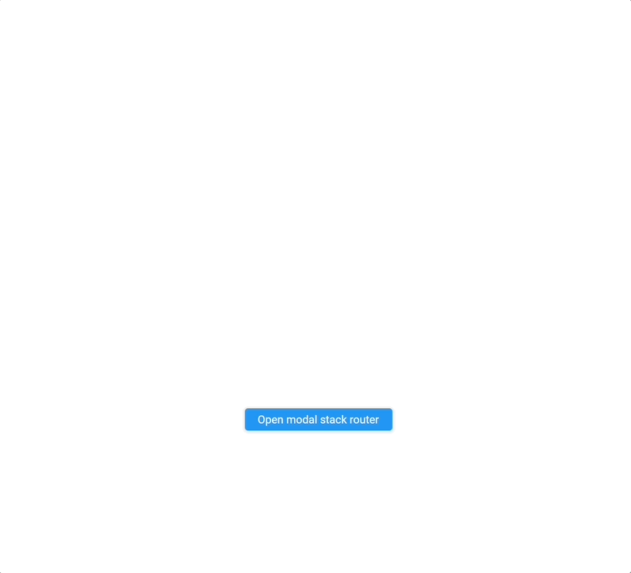

# Modal stack router

A Flutter library for creating modal flows and wizards commonly used on large screen devices like desktop web. Uses [modal_bottom_sheet](https://pub.dev/packages/modal_bottom_sheet) for showing widgets in a modal and [stack_router](https://pub.dev/packages/stack_router) for building complex flows.

.

## Example

```dart
import 'package:modal_stack_router/modal_stack_router.dart';

class ExampleStackRoutes {
  static const String firstRoute = 'firstRoute';
  static const String secondRoute = 'secondRoute';
}

class ExampleStackRouter extends StatelessWidget {
  const ExampleStackRouter({
    Key? key,
  }) : super(key: key);

  @override
  build(context) {
    return StackRouter(
      initialRoute: ExampleStackRoutes.firstRoute,
      builder: (router) {
        return [
          StackRoute(
            route: ExampleStackRoutes.firstRoute,
            child: StackRouterScaffold(
              height: 400,
              width: 600,
              child: Expanded(
                child: Center(
                  child: ElevatedButton(
                    onPressed: () {
                      router.pushRoute(ExampleStackRoutes.secondRoute);
                    },
                    child: const Text(
                      "Go to second route",
                      style: TextStyle(color: Colors.white),
                    ),
                  ),
                ),
              ),
            ),
          ),
          StackRoute(
            route: ExampleStackRoutes.secondRoute,
            child: StackRouterScaffold(
              height: 450,
              width: 600,
              appBar: const StackRouterAppBar(
                title: Text("I'm a Title", style: TextStyle(fontSize: 20)),
              ),
              child: Expanded(
                child: Container(
                  color: Colors.blue,
                  alignment: Alignment.center,
                  child: Column(
                    mainAxisAlignment: MainAxisAlignment.center,
                    children: [
                      const Text(
                        "I'm the second route",
                        style: TextStyle(
                          color: Colors.white,
                        ),
                      ),
                      const Padding(padding: EdgeInsets.only(top: 16)),
                      ElevatedButton(
                        style: ButtonStyle(
                          backgroundColor:
                              MaterialStateProperty.all(Colors.white),
                        ),
                        onPressed: () {
                          router.showSnackBar(
                            snackBar: const StackRouterSnackBar(
                              title: Text(
                                "I'm a snackbar!",
                                style: TextStyle(color: Colors.white),
                              ),
                            ),
                          );
                        },
                        child: const Text(
                          "Show snack bar",
                          style: TextStyle(color: Colors.black),
                        ),
                      ),
                    ],
                  ),
                ),
              ),
            ),
          ),
        ];
      },
    );
  }
}

// Show our modal stack router flow
showModalStackRouter(
  context: context,
  child: const ExampleStackRouter(),
);
```

Run [the example](./example) to see it in action.

